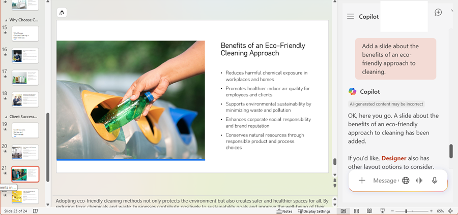
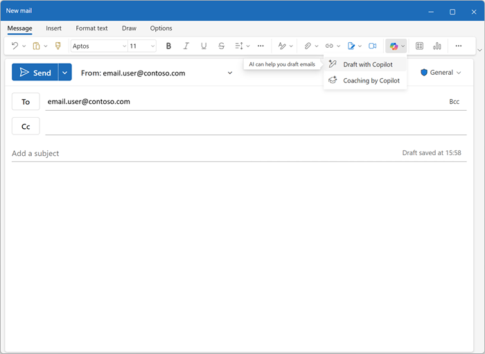

---
lab:
  title: "Explorer Microsoft\_365\_Copilot"
---
# Explorer Microsoft 365 Copilot

Bienvenue dans le monde passionnant de Microsoft 365 Copilot

Dans cet exercice, vous allez exploiter la puissance de Copilot pour explorer une nouvelle idée d’entreprise : lancer une société de nettoyage pour entreprises.

Imaginez ceci : vous êtes sur le point de lancer un service de nettoyage haut de gamme qui révolutionnera les espaces de bureau partout. Avec Microsoft Copilot à vos côtés, vous allez rechercher les tendances du marché et développer un plan d’affaires solide. Mais ce n’est pas tout. Vous allez également créer des documents convaincants, des présentations percutantes et des e-mails persuasifs pour donner vie à votre idée et attirer des investisseurs.

Préparez-vous à libérer votre créativité et votre sens des affaires en parcourant ce labo attrayant et interactif. À la fin de cet exercice, vous disposerez d’un ensemble complet de documents qui vous mettront sur la voie du succès entrepreneurial. Commençons et faisons de votre société de nettoyage pour entreprises une réalité.

Cet exercice devrait prendre environ **40** minutes.

> **Remarque** : cet exercice requiert une licence **Microsoft 365 Copilot**.

## Utiliser Copilot pour explorer un document et rechercher une idée

Pour démarrer votre exploration de l’IA générative, vous allez utiliser Copilot pour Word pour examiner un document existant et en extraire des insights.

1. Dans votre navigateur web, ouvrez le document [Business Idea.docx](https://github.com/MicrosoftLearning/mslearn-copilot/raw/main/Allfiles/Business%20Idea.docx) à l’emplacement `https://github.com/MicrosoftLearning/mslearn-copilot/raw/main/Allfiles/Business%20Idea.docx`. 
1. Téléchargez le fichier dans votre dossier **Téléchargements**. Ensuite, fermez l’onglet du navigateur.
1. Sélectionnez **Déplacer** ou **Copier et coller** pour placer le document que vous venez de télécharger dans le dossier **OneDrive**.
1. Dans votre dossier **OneDrive**, ouvrez **Business Idea.docx** dans Microsoft Word (en fermant les messages de bienvenue ou les notifications de nouvelles fonctionnalités), puis passez en revue le document qui décrit quelques idées générales pour une entreprise de nettoyage à New York. Si vous y êtes invité, sélectionnez **Activer la modification** en haut.

    > **Conseil** : vous pouvez fermer le **volet de navigation** s’il est ouvert pour afficher une plus grande partie du document.

1. Recherchez et sélectionnez l’icône **Copilot** dans la barre d’outils de Word pour ouvrir le volet Copilot, comme vous pouvez le voir ici (votre thème visuel peut varier) :

    

1. Dans le volet Copilot, entrez le prompt suivant dans la zone de texte en bas :

    ```prompt
    Summarize this document into 5 key points, and suggest next steps.
    ```

1. Passez en revue la réponse de Copilot qui doit résumer les principaux points du document. En voici un exemple :

    

    > La réponse spécifique que vous recevez peut varier en raison de la nature de l’IA générative.

    J’espère que Copilot a fourni des conseils utiles. Toutefois, si vous avez des questions supplémentaires, vous pouvez simplement demander des informations plus spécifiques.

1. Revenez au volet Copilot et posez à Copilot la question suivante :

    ```prompt
    How do I setup a new business in New York? Answer with a numbered list.
    ```

1. Passez en revue la réponse et posez des questions supplémentaires si nécessaire. Quand la réponse vous convient, utilisez l’icône **Copier** (&#128461;) située sous la réponse pour la copier dans le Presse-papiers. Collez-la dans le document Word après le texte existant. Sélectionnez ensuite le texte qui fournit une liste des étapes à suivre lors de la création d’une entreprise à New York et utilisez l’icône Copilot (en bas du texte sélectionné) pour visualiser le texte sous forme de tableau.

    

1. Passez en revue le tableau et demandez à Copilot d’ajouter plus d’informations, comme une colonne avec des références pour plus de détails.   Votre réponse doit ressembler à ceci (vous devrez peut-être utiliser le bouton **Regénérer**) :

    

    > **Important** : la réponse générée par l’IA est basée sur des informations publiques sur le web. Bien que cette réponse puisse vous aider à comprendre les étapes nécessaires à la création d’une entreprise, son exactitude n’est pas garantie à 100 % et elle ne saurait remplacer l’avis d’un professionnel.

1. Quand le tableau généré par Copilot vous convient, sélectionnez l’option **Conserver**.

## Utiliser Copilot pour créer le contenu d’un plan d’entreprise

Après ces quelques recherches initiales, demandons à Copilot de vous aider à développer un plan d’entreprise pour votre entreprise de nettoyage.

1. Le document **Business Idea.docx** étant toujours ouvert, entrez le prompt suivant dans le volet Copilot :

    ```prompt
    Can you suggest a name for my cleaning business?
    ```

1. Passez en revue les suggestions et sélectionnez un nom pour votre société de nettoyage (ou continuez à entrer des prompts pour trouver un nom qui vous plaît).
1. Créez un document vierge. Ensuite, dans le nouveau document, sélectionnez l’icône Copilot dans la marge pour rédiger un nouveau contenu. Entrez le prompt suivant, en remplaçant **Contoso Cleaning** par le nom de l’entreprise de votre choix :

    ```prompt
    Write a business plan for "Contoso Cleaning" based on the information in /Business Idea.docx. Include an executive summary, market overview, and financial projections.
    ```

    

    > **Conseil** : saisissez le prompt et lorsque vous tapez « / » Copilot doit vous permettre de parcourir les documents dans votre dossier OneDrive. Si Copilot ne suggère aucun document, cela peut être dû au fait que votre OneDrive n’a pas encore été entièrement indexé. Dans ce cas, modifiez le prompt en `Write a business plan for "Contoso Cleaning", a commercial cleaning buisness in New York. Include an executive summary, market overview, and financial projections.`.

1. Générez et examinez une réponse. Ensuite, conservez-la, ajustez le ton et la longueur ou demandez à Copilot de la réécrire avec un nouveau prompt. Appliquez les titres et le style appropriés à votre document pour qu’il soit professionnel avant de l’enregistrer sous le nom **Business Plan.docx** dans votre dossier OneDrive. Votre document doit ressembler à ce qui suit :

    

## Visualiser les projections financières dans Copilot pour Excel

Plan d’entreprise en main, nous allons prendre une partie de ces données sur les projections financières et demander à Copilot dans Excel de créer une visualisation de ces données pour que nous puissions l’inclure dans des e-mails ou des présentations à des investisseurs.

1. Avec le document **Business Plan** ouvert dans Microsoft Word, ouvrez le volet Copilot.
1. Si le plan d’affaires généré comprenait une liste de profits projetés, entrez le prompt suivant :

    ```prompt
    Create a table of the projected profits in this document.
    ```

    Sinon, saisissez ce prompt :

    ```prompt
    Create a table of projected profits for the next 5 years, starting with this year. The profit this year should be $10,000 and it should increase by 12% each year.
    ```

1. Copiez la tableau des profits projetés dans le presse-papiers.
1. Ouvrez **Excel** et créez un classeur vide. Enregistrez immédiatement le classeur sous le nom **Financial Projections.xlsx** sur votre dossier OneDrive.
1. Collez le tableau des projections de bénéfices dans la feuille de calcul Excel et **mettez-le en forme en tant que tableau**. Pour ce faire :
    1. Sélectionnez une **cellule** dans vos données.
    1. Sélectionnez **Accueil**, puis choisissez **Mettre sous forme de tableau** sous Styles. 
    1. Choisissez un style pour votre tableau.
    1. Dans la boîte de dialogue **Créer un tableau**, confirmez ou définissez votre plage de cellules.
    1. Indiquez si votre tableau comporte des en-têtes, puis sélectionnez **OK**.
1. Une fois vos projections de ventes mises sous forme de tableau, ouvrez le volet Copilot à partir de l’onglet **Accueil** du ruban Excel et entrez le prompt suivant :

    ```prompt
    Suggest ways to visualize these financial projections.
    ```
    
1. Copilot doit vous suggérer une façon de visualiser vos données et vous proposer d’ajouter un graphique croisé dynamique à une nouvelle feuille.

    

    > **Conseil** : si Copilot suggère un autre format pour les données, entrez le prompt de suivi `Visualize the data as a line chart.`.

1. Sélectionnez l’option dans la réponse Copilot pour ajouter le graphique croisé dynamique à une nouvelle feuille et l’ouvrir. Sélectionnez le graphique, puis **Créer** pour appliquer des styles, modifier le type de graphique et effectuer d’autres actions. À la fin, vous devriez avoir quelque chose qui ressemble à ceci :

    

1. Enregistrez le classeur et fermez Excel.

Vous venez d’utiliser des données créées à partir de Copilot dans Word pour les visualiser dans Excel. Dans l’exercice suivant, vous allez utiliser Copilot dans Outlook pour composer et envoyer des e-mails sur le travail que vous avez effectué.

## Utiliser Copilot pour créer le contenu d’une présentation

Avec l’aide de Copilot, vous avez créé le brouillon d’un plan d’affaires pour l’idée d’une société de nettoyage et préparé quelques projections financières. Vous avez maintenant besoin d’une présentation efficace pour communiquer les atouts de votre entreprise.

1. Ouvrez **PowerPoint** et créez une **présentation vide**. Si le volet **Concepteur** s’ouvre automatiquement, fermez-le.
1. Enregistrez la présentation sous le nom **Cleaning Company.pptx** dans votre dossier OneDrive.
1. Sélectionnez le **bouton Copilot** sous l’**onglet Accueil** du ruban, sélectionnez **Créer une présentation sur...**, puis complétez le prompt dans le volet Copilot comme ceci :

    ```prompt
    Create a presentation about a corporate cleaning service named "Contoso Cleaning" in New York City. The presentation should include the benefits of using a professional cleaning business.
    ```

1. Copilot génère des diapositives dans la présentation.  Le processus peut prendre plusieurs minutes et votre sortie doit ressembler à ceci avec un thème différent :

    

1. Sélectionnez l’avant-dernière diapositive de la présentation (avant la dernière diapositive *Conclusion*, si Copilot en a généré une).  Puis, dans le volet Copilot, dans la zone de conversation, sélectionnez l’icône **Afficher les invites** et sélectionnez l’invite **Ajouter une diapositive à propos de...** pour créer une diapositive à l’aide de l’invite `Add a slide about the benefits of an eco-friendly approach to cleaning.`.

    

1. Enregistrez la présentation et fermez PowerPoint.

## Utiliser Copilot pour organiser une réunion de financement

Vous avez créé des documentations et ressources d’accompagnement pour vous aider à démarrer votre entreprise. Il est temps de prendre contact avec un investisseur pour obtenir un capital de démarrage.

1. Ouvrez **Outlook** et, dans la barre de titre, utilisez l’icône **Copilot** pour ouvrir le volet Copilot.
1. Basculez vers la page **Calendrier** et passez à l’affichage **Semaine de travail**. Si vous n’avez pas encore d’événements planifiés dans votre calendrier pour cette semaine, vous pouvez en ajouter quelques-uns afin que Copilot dispose de certaines informations à utiliser.
1. Dans le volet Copilot qui s’affiche, entrez le prompt suivant :

    ```
    What events do I have scheduled this week?
    ```

    Copilot devrait répondre avec un résumé de vos événements planifiés de la semaine, vous aidant à identifier la disponibilité d’une réunion avec un banquier pour organiser le financement de votre entreprise.

1. Basculez vers la page **E-mail**, créez un e-mail, puis remplissez la case **À** avec votre adresse e-mail.
1. Sélectionnez l’option **Rédiger avec Copilot** :

    
    
1. Entrez le prompt suivant pour générer un brouillon d’e-mail :

    ```prompt
    Write an email to a bank manager requesting a meeting to discuss funding for a commercial cleaning business. The email should be concise and the tone should be professional.
    ```

1. Utilisez Copilot pour affiner le contenu de l’e-mail, puis sélectionnez **Conserver** pour finaliser le message.

    

1. Vous pouvez vous envoyer l’e-mail si vous le souhaitez !

## Défi

Vous venez de voir comment utiliser Microsoft 365 Copilot pour rechercher des idées et générer du contenu. Et si nous allions un peu plus loin ? 

En fonction de ce que vous avez appris dans cet exercice, essayez d’utiliser Copilot pour planifier une réunion dans laquelle vous proposerez l’adoption de l’IA générative dans votre organisation. Voici quelques idées pour bien démarrer :

- Recherchez les avantages de l’IA générative et de Microsoft Copilot pour les entreprises, en recherchant des informations sur les avantages de productivité, les économies de coûts et des exemples d’organisations qui ont déjà adopté l’IA.
- Créez un document de discussion que vous pouvez faire circuler comme document à lire avant la réunion.
- Créez une présentation que vous pouvez utiliser pour présenter votre cas, y compris les données et les visualisations pour mettre en évidence les éléments clés de votre pitch.
- Rédigez un e-mail pour informer vos collègues de la réunion et leur fournir des informations à son sujet.

Soyez aussi inventif que vous le souhaitez et découvrez comment Copilot peut vous aider en trouvant des informations, en générant et en affinant du texte, en créant des images et en répondant à des questions.

## Conclusion

Dans cet exercice, vous avez utilisé [Microsoft 365 Copilot](https://www.microsoft.com/microsoft-365/enterprise/copilot-for-microsoft-365) pour trouver des informations et générer du contenu. Nous espérons que vous avez vu comment l’utilisation de l’IA générative dans un copilote peut améliorer la productivité et la créativité. Microsoft 365 vous permet d’apporter la puissance de l’IA générative à vos données et processus métier, tout en l’intégrant à votre infrastructure informatique existante pour garantir une solution gérable et sécurisée.
