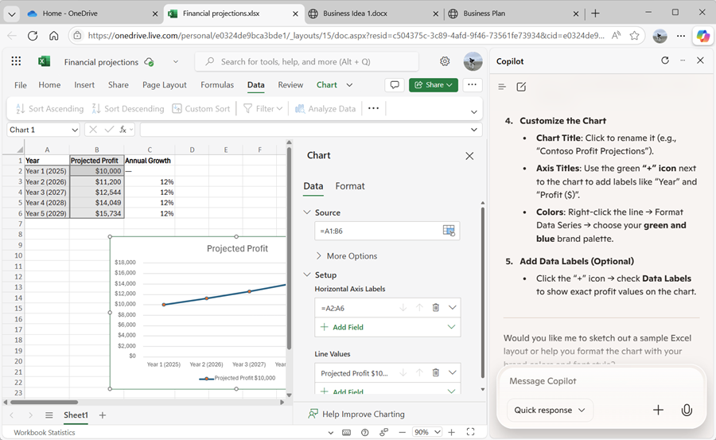

---
lab:
  title: Découvrir Copilot dans Microsoft Edge
---
# Découvrir Microsoft Copilot dans Microsoft Edge

Bienvenue dans le monde passionnant de Microsoft Copilot

Dans cet exercice, vous allez exploiter la puissance de Copilot pour explorer une nouvelle idée d’entreprise : lancer une société de nettoyage pour entreprises.

Imaginez ceci : vous êtes sur le point de lancer un service de nettoyage haut de gamme qui révolutionnera les espaces de bureau partout. Avec Microsoft Copilot à vos côtés, vous allez rechercher les tendances du marché et développer un plan d’affaires solide. Mais ce n’est pas tout. Vous allez également créer des documents convaincants, des présentations percutantes et des e-mails persuasifs pour donner vie à votre idée et attirer des investisseurs.

Préparez-vous à libérer votre créativité et votre sens des affaires en parcourant ce labo attrayant et interactif. À la fin de cet exercice, vous disposerez d’un ensemble complet de documents qui vous mettront sur la voie du succès entrepreneurial. Commençons et faisons de votre société de nettoyage pour entreprises une réalité.

> **Important** : cet exercice fournit des invites que vous pouvez utiliser pour travailler avec Copilot. Vous devez les utiliser comme *point de départ* pour votre exploration de Copilot. Vous êtes invité à modifier ces invites et à ajouter des invites de votre choix pour participer à un dialogue itératif avec Copilot et affiner les résultats qu’il produit. Vous pourrez ne pas obtenir exactement la sortie décrite dans les instructions de l’exercice, mais cela n’a pas d’importance. Le but est d’expérimenter Copilot.

Cet exercice devrait prendre environ **40** minutes.

> **Remarque** : Cet exercice suppose que vous disposez d’un [compte Microsoft personnel](https://signup.live.com) (tel qu’un compte outlook.com) avec lequel vous êtes connecté à [Microsoft Edge](https://www.microsoft.com/edge/download) sur votre ordinateur. Si vous disposez à la fois d’un compte professionnel et d’un compte personnel, veillez à sélectionner votre *compte personnel* dans les paramètres du compte en haut à gauche de Microsoft Edge.

## Utiliser Copilot pour explorer un document et rechercher une idée

Pour démarrer votre exploration de l’IA générative, vous allez utiliser Microsoft Copilot dans Edge pour examiner un document existant et en extraire des insights.

1. Dans Microsoft Edge, accédez à [OneDrive](https://onedrive.live.com) à l’adresse `https://onedrive.live.com` et connectez-vous à l’aide de votre compte Microsoft personnel, en fermant tout message de bienvenue ou toute offre affichée.
1. Dans un autre onglet du navigateur web, ouvrez le document [Business Idea.docx](https://github.com/MicrosoftLearning/mslearn-copilot/raw/main/Allfiles/Business%20Idea.docx) depuis l’emplacement `https://github.com/MicrosoftLearning/mslearn-copilot/raw/main/Allfiles/Business%20Idea.docx`. Ensuite, lorsque le document s’ouvre dans Edge, sélectionnez l’option **Modifier une copie** pour copier le document dans votre OneDrive. Le document doit ensuite s’ouvrir automatiquement dans Microsoft Word online.

    > **Conseil** : si l’option permettant de modifier une copie ne s’affiche pas, téléchargez la copie sur votre ordinateur local. Ensuite, dans OneDrive, utilisez le bouton **+ Ajouter un nouveau** pour charger le fichier **Business Idea.docx** à partir de votre ordinateur local sur OneDrive.

1. Affichez le texte dans le document **Business Idea.docx** qui décrit quelques idées générales pour une société de nettoyage à New York.
1. Utilisez l’icône **Copilot** dans la barre d’outils Edge pour ouvrir le volet Copilot, comme illustré ici :

    

    > **Conseil** : Microsoft Copilot est continuellement amélioré. Votre interface utilisateur peut ne pas correspondre exactement à l’image affichée.

1. Dans la zone de conversation au bas du volet Copilot, entrez le prompt suivant :

    ```prompt
    Summarize this document into 5 key points, and suggest next steps.
    ```

    Si vous y êtes invité, confirmez que vous souhaitez autoriser Copilot à accéder à la page.

1. Passez en revue la réponse de Copilot, qui doit résumer les principaux points du document et suggérer des actions de suivi à entreprendre, comme illustré ici :

    

    > **Remarque** : La réponse spécifique peut varier.

    J’espère que Copilot a fourni des conseils utiles. Toutefois, si vous avez des questions supplémentaires, vous pouvez simplement demander des informations plus spécifiques.

1. Entrez l’invite suivante :

    ```prompt
    How do I go about setting up a business in New York?
    ```

1. Passez en revue la réponse. Elle doit contenir des conseils et des liens vers des ressources pour vous aider à fonder une entreprise à New York.

    > **Important** : La réponse générée par l’IA est basée sur des informations publiques sur le web. Bien que cette réponse puisse vous aider à comprendre les étapes nécessaires à la création d’une entreprise, son exactitude n’est pas garantie à 100 % et elle ne saurait remplacer l’avis d’un professionnel !

## Utiliser Copilot pour créer le contenu d’un plan d’entreprise

Après ces quelques recherches initiales effectuées, demandons à Copilot de vous aider à développer un plan d’entreprise pour votre entreprise de nettoyage.

1. Le document **Business Idea.docx** étant toujours ouvert dans Microsoft Edge, entrez le prompt suivant dans le volet Copilot :

    ```prompt
    Suggest a name for my cleaning business.
    ```

1. Passez en revue les suggestions et sélectionnez un nom pour votre société de nettoyage (ou continuez à entrer des prompts pour trouver un nom qui vous plaît). Lorsque vous en avez choisi un, indiquez à Copilot lequel, par exemple, entrez `Let's go with the first one.`.
1. Vérifiez que le document **Business Idea** est toujours ouvert dans la page du navigateur principal, puis entrez le prompt suivant :

    ```prompt
    Based on the contents of this document, create a business plan for my cleaning business.
    ```

1. Vérifiez la réponse. Ensuite, dans le volet Microsoft Word, dans le menu **Fichier**, créez un document vierge. Fermez le volet **Concepteur** s’il s’ouvre et remplacez le nom du nouveau document *Document* par `Business Plan`.
1. Copiez le plan d’affaires généré dans le volet Copilot et collez-le dans le document du plan d’affaires :

    

1. Dans le volet Copilot qui s’affiche, entrez le prompt suivant :

    ```prompt
    Create a corporate logo for the cleaning company. The logo should be round and include an iconic New York landmark.
    ```

1. Passez en revue l’image générée par Copilot.

1. Utilisez plus de prompts pour itérer sur le design (par exemple `Make it green and blue`) jusqu’à obtenir un logo qui vous plaît.

    > **Conseil** : lorsque Coplot génère des images qui contiennent du texte, vous remarquerez peut-être des fautes d’orthographe. Essayez différents prompts jusqu’à ce que vous soyez satisfait des résultats.

1. Cliquez avec le bouton droit sur le logo généré et copiez-le dans le presse-papiers. Collez-le ensuite en haut du document du plan d’entreprise, comme suit :

    

1. Fermez les onglets du navigateur Microsoft Word et revenez à votre espace OneDrive.

## Utiliser Copilot pour générer et visualiser des projections financières

Avec l’aide de Copilot, vous avez créé le brouillon d’un plan d’entreprise pour l’idée d’une société de nettoyage. Nous allons maintenant utiliser Copilot pour effectuer quelques calculs qui aideront à peaufiner le plan d’affaires.

1. Dans le volet Copilot qui s’affiche, entrez le prompt suivant :

    ```prompt
    Create a table of projected profits for the next 5 years, starting with this year. The profit this year should be $10,000 and it should increase by 12% each year.
    ```

1. Passez en revue la réponse, qui devrait inclure un tableau des bénéfices prévus pour les cinq prochaines années.
1. Si une option de modification du tableau dans Excel est affichée, sélectionnez-la pour créer un classeur avec la table des données. Sinon, revenez à l’onglet OneDrive et utilisez le **bouton (+)** pour ajouter un nouveau **classeur Excel**. Copiez ensuite la table des données du volet Copilot dans le classeur.

1. Remplacez le nom du classeur par `Financial Projections`. Il doit ressembler à ceci :

    

1. Dans le volet Copilot qui s’affiche, entrez le prompt suivant :

    ```prompt
    What's a good way to visualize these projections in a chart?
    ```

1. Passez en revue la réponse, qui devrait recommander quelques façons de visualiser les données de projection. Entrez ensuite le prompt suivant :

    ```prompt
    How do I create a line chart in Excel?
    ```

1. Suivez les instructions fournies par Copilot pour créer un graphique en courbes.

    > **Conseil** : vous devrez peut-être ajuster l’axe des données par défaut sélectionné par Excel. Sélectionnez le graphique dans la feuille de calcul, puis, sous l’onglet **Graphique**, sélectionnez **Sélectionner des données**. Ensuite, dans le volet **Graphique**, sous l’onglet **Données**, modifiez la configuration afin que le champ **Année** soit l’étiquette horizontale et que seul le champ **Profit projeté** est utilisé comme valeur de ligne :

    

1. Fermez l’onglet **Graphique** pour afficher le graphique dans la feuille de calcul.

1. Fermez l’onglet du navigateur Microsoft Excel et revenez à votre espace OneDrive.

## Utiliser Copilot pour créer le contenu d’une présentation

Grâce à Copilot, vous avez créé un plan d’affaires pour la société de nettoyage et généré des projections financières. Vous devez maintenant disposer d’une présentation efficace pour convaincre un investisseur de vous prêter le financement pour démarrer l’entreprise.

1. Dans OneDrive, ajoutez une nouvelle **présentation PowerPoint**. Si le volet **Concepteur** s’ouvre automatiquement, fermez-le. Modifiez ensuite le nom de la présentation *Présentation* en `Business Presentation`.

1. Dans la diapositive du titre de la présentation, entrez le nom de votre entreprise de nettoyage comme titre, mais également `Investor Opportunity` comme sous-titre.
1. Ajoutez une nouvelle diapositive à l’aide de la disposition des diapositives **Deux contenus** (qui inclut un titre et deux espaces réservés au contenu).
1. Modifiez le titre de la diapositive en `Benefits of Hiring a Commercial Cleaner`.
1. Dans le volet Copilot qui s’affiche, entrez le prompt suivant :

    ```prompt
    Write a summary of the benefits of using a corporate cleaning company for your business. The summary should consist of five short bullet points.
    ```

1. Copiez la réponse de Copilot dans le presse-papiers et collez-la dans l’espace réservé de contenu de gauche. Ensuite, modifiez et remettez en forme le texte dans l’espace réservé jusqu’à ce que vous soyez satisfait.
1. Dans le volet Copilot qui s’affiche, entrez le prompt suivant :

    ```prompt
    Create a photorealistic image of a clean office.
    ```

1. Lorsque Copilot a généré une image qui vous plaît, copiez-la dans le presse-papiers et collez-la dans l’espace réservé de contenu à la droite de la diapositive.

    Si le volet **Concepteur** s’ouvre automatiquement, sélectionnez une conception de la diapositive que vous aimez. Fermez ensuite le volet **Concepteur**.

1. Appliquez toute mise en forme supplémentaire que vous jugez nécessaire jusqu’à obtenir une diapositive qui vous satisfait :

    

1. Ouvrez un nouvel onglet de navigateur et utilisez-le pour télécharger l’image [mopping.png](https://github.com/MicrosoftLearning/mslearn-copilot/raw/main/Allfiles/mopping.png) à partir de `https://github.com/MicrosoftLearning/mslearn-copilot/raw/main/Allfiles/mopping.png` vers votre ordinateur local, en l’enregistrant dans n’importe quel dossier.
1. Revenez à l’onglet du navigateur contenant votre présentation PowerPoint et, dans le volet Copilot, utilisez le bouton **+** en regard de la zone de conversation pour charger l’image **mopping.png** dans Copilot et ajouter l’invite `What does this image show?`.
1. Passez en revue la réponse, qui doit être similaire à ceci :

    

1. Suivez le prompt suivant et passez en revue la réponse :

    ```prompt
    Would this image be helpful to promote a commercial cleaning business?
    ```

    Copilot a analysé l’image et évalué son utilité pour votre scénario d’entreprise spécifique de la même façon que vous pourriez demander l’opinion d’un collègue.

1. Dans PowerPoint, ajoutez une nouvelle diapositive avec la même disposition à **deux contenus** que précédemment. Ensuite, dans l’un des espaces réservés de contenu, chargez l’image **mopping.png** pour l’ajouter à la diapositive.

1. Dans le volet Copilot qui s’affiche, entrez le prompt suivant :

    ```prompt
    Write a short paragraph to accompany this image, emphasizing the professionalism of the cleaning staff we employ.
    ```

1. Passez en revue le texte obtenu, copiez-le dans l’espace réservé de contenu vide sur la diapositive, modifiez-le et mettez-le en forme selon vos besoins.
1. Dans le volet Copilot qui s’affiche, entrez le prompt suivant :

    ```prompt
    Suggest a good title for a slide that contains the image and text.
    ```

1. Utilisez le titre suggéré pour la diapositive, puis utilisez le Concepteur dans PowerPoint pour mettre en forme la diapositive. Vous devez vous retrouver avec une diapositive similaire à celle-ci :

    

1. Fermez l’onglet du navigateur PowerPoint et revenez dans votre espace OneDrive.

## Utiliser Copilot pour organiser une réunion de financement

Vous avez créé des documentations et ressources d’accompagnement pour vous aider à démarrer votre entreprise. Il est temps de prendre contact avec un investisseur pour obtenir un capital de démarrage.

1. Utilisez le **lanceur d’applications** (&#8759;) à gauche de la barre de titre OneDrive pour ouvrir **Outlook**.

1. Dans la page **E-mail**, créez un e-mail. Renseignez la zone **À** avec votre adresse e-mail et définissez l’**objet** sur `Business funding meeting request`.
1. Dans le volet Copilot qui s’affiche, entrez le prompt suivant :

    ```prompt
    Write an email to a bank manager requesting a meeting to discuss funding for a commercial cleaning business. The email should be concise and the tone should be professional.
    ```
    
1. Utilisez le contenu généré pour terminer votre e-mail, comme indiqué ici :

    

    Vous pouvez vous envoyer l’e-mail si vous le souhaitez !

## Défi

Vous venez de voir comment utiliser Copilot pour rechercher des idées et générer du contenu. Et si nous allions un peu plus loin ? Pour démarrer une nouvelle session Copilot, dans le menu **+** en regard de la zone de conversation, sélectionnez **Démarrer une nouvelle conversation**. Ensuite, en fonction de ce que vous avez appris dans cet exercice, essayez d’utiliser Copilot pour planifier une réunion dans laquelle vous proposerez l’adoption de l’IA générative dans votre organisation. Voici quelques idées pour bien démarrer :

- Recherchez les avantages de l’IA générative et de Microsoft Copilot pour les entreprises, en recherchant des informations sur les avantages de productivité, les économies de coûts et des exemples d’organisations qui ont déjà adopté l’IA.
- Créez un document de discussion que vous pouvez faire circuler comme document à lire avant la réunion.
- Créez une présentation que vous pouvez utiliser pour présenter votre cas, y compris les données et les visualisations pour mettre en évidence les éléments clés de votre pitch.
- Rédigez un e-mail pour informer vos collègues de la réunion et leur fournir des informations à son sujet.

Soyez aussi inventif que vous le souhaitez et découvrez comment Copilot peut vous aider en trouvant des informations, en générant et en affinant du texte, en créant des images et en répondant à des questions.

## Conclusion

Dans cet exercice, vous avez utilisé Copilot dans Microsoft Edge pour trouver des informations et générer du contenu. Nous espérons que vous avez vu comment l’utilisation de l’IA générative dans un copilote peut améliorer la productivité et la créativité.

Bien que les services gratuits utilisés dans ces exercices soient sans aucun doute très puissants, vous pouvez obtenir encore plus avec des services tels que [Microsoft 365 Copilot](https://www.microsoft.com/microsoft-365/enterprise/copilot-for-microsoft-365), dans lesquels Microsoft Copilot est intégré aux applications de productivité Windows et Microsoft Office, fournissant une aide hautement contextuelle avec des tâches courantes. Microsoft 365 vous permet d’apporter la puissance de l’IA générative à vos données et processus d’entreprise, tout en l’intégrant à votre infrastructure informatique existante pour garantir une solution gérable et sécurisée.